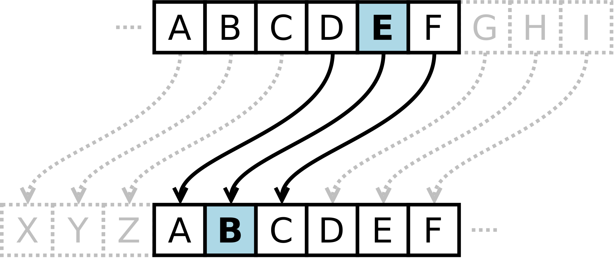

# Cifra de César

Um dos grandes generais que usava mensagens codificadas foi Júlio César, por volta de 50 a.C. Quando César enviava mensagens para seus generais, ele as criptografava deslocando as letras do texto por um número fixo de posições no alfabeto. Os destinatários da mensagem podiam decifrá-la porque sabiam o valor do deslocamento — enquanto todos os outros viam apenas um texto sem sentido.

Por exemplo, se você escrever `NIKOLATESLA` e deslocar cada letra três posições para a direita:

```text
A B C D E F G H I J K L M N O P Q R S T U V W X Y Z
X Y Z A B C D E F G H I J K L M N O P Q R S T U V W
```

A letra `N` vira `K`, `I` vira `F` e assim por diante. Assim, cada letra é substituída por outra letra que está um número fixo de posições à frente no alfabeto. Quando o final do alfabeto é alcançado, a sequência continua do início. O resultado do deslocamento de três letras para a direita seria a mensagem criptografada `KFHLIXQBPIX`. Por outro lado, se cada letra da palavra resultante fosse deslocada três letras para a esquerda:

```text
A B C D E F G H I J K L M N O P Q R S T U V W X Y Z
D E F G H I J K L M N O P Q R S T U V W X Y Z A B C
```

A letra `K` vira `N`, `F` vira `I` e assim por diante. O resultado do deslocamento seria a mensagem original descriptografada `NIKOLATESLA`.



## Tarefa simples

Crie um aplicativo de console em qualquer linguagem de programação para criptografar e descriptografar mensagens usando a cifra de César.

```{infonote}
O primeiro aluno (*o driver*) deve focar na sintaxe ao escrever o código para criptografia da mensagem. O segundo aluno (*o navegador*) deve revisar cada linha de código à medida que é digitada, procurando erros, fazendo perguntas e sugerindo melhorias. Depois disso, os alunos devem trocar de papéis e continuar escrevendo o código de descriptografia.
```

O alfabeto permitido para mensagens (tanto para texto simples quanto para texto cifrado) pode incluir apenas letras minúsculas do alfabeto inglês:

```text
Σ = { a, b, c, d, e, f, g, h, i, j, k, l, m, n, o, p, q, r, s, t, u, v, w, x, y, z }
```

Espaços, letras maiúsculas, números e outros caracteres não são permitidos.

Na primeira linha da entrada do usuário haverá uma mensagem `m` com no máximo cem caracteres, na segunda linha haverá um inteiro `n` que representa o valor do deslocamento ($1 \leq n < 26$), e na terceira linha haverá um inteiro `s`, que representa a direção da criptografia. Se $s=1$ então `m` deve ser criptografada, e se $s=2$, então `m` deve ser descriptografada.

### Exemplo de teste 1

Se a entrada for:

```text
nikolatesla
3
1
```

a saída deve ser:

```text
kfhlixqbpix
```

### Exemplo de teste 2

Se a entrada for:

```text
kfhlixqbpix
3
2
```

a saída deve ser:

```text
nikolatesla
```

## Inicie a tarefa

[Implemente a cifra aqui ](https://arena.petlja.org/sr-Latn-RS/competition/123-co-create#tab_142923)

## Dicas de solução

Como existem 26 letras no alfabeto inglês, a posição de cada letra pode ser representada por um número de 0 a 25.

* a → 0
* b → 1
* c → 2
* ...
* z → 25

Para **criptografar** uma letra, você pode usar a seguinte fórmula:

```text
nova_posicao_letra = (posicao_atual_letra + valor_deslocamento) mod 26
```

`posicao_original` representa o valor numérico da letra no alfabeto, `valor_deslocamento` representa o número de posições a mover (1–25), e `mod 26` garante que o resultado volte ao início do alfabeto se ultrapassar `z`.

Para **descriptografar** uma letra, você pode usar a seguinte fórmula:

```text
nova_posicao_letra = (posicao_atual_letra - valor_deslocamento + 26) mod 26
```

Semelhante à criptografia, mas você subtrai o valor do deslocamento, e `+ 26` garante que o valor não fique negativo antes de aplicar o `mod 26`.

## Tarefas avançadas de Cifra de César (opcional)

### Expanda o alfabeto permitido

Crie um aplicativo de console em qualquer linguagem de programação para criptografar e descriptografar mensagens usando a cifra de César. O alfabeto permitido para mensagens (texto simples e texto cifrado) pode incluir letras minúsculas e maiúsculas do alfabeto inglês, espaços, números e pontuação!

O aplicativo deve criptografar ou descriptografar apenas letras minúsculas e maiúsculas. Espaços, números e sinais de pontuação devem permanecer inalterados durante a criptografia ou descriptografia.

Na primeira linha da entrada padrão haverá uma mensagem `m` com no máximo cem caracteres, na segunda linha haverá um inteiro `n` que representa o deslocamento ($1 \leq n < 26$), e na terceira linha haverá um inteiro `s`, que representa a direção da criptografia. Se $s=1$ então `m` deve ser criptografada, e se $s=2$, então `m` deve ser descriptografada.

## Use funções

Crie duas funções: uma para criptografar mensagens e outra para descriptografar mensagens. Use as funções criadas em seu programa principal.

## Crie uma Classe

Crie uma classe `CaesarCipher` que contenha:

* um construtor com um parâmetro que aceita o valor do deslocamento e garante que o valor esteja dentro do intervalo permitido,
* uma propriedade privada para armazenar o valor do deslocamento, com métodos getter e setter,
* um método público para criptografar a mensagem,
* um método público para descriptografar a mensagem, e
* opcionalmente, inclua um método privado para processar mensagens, que será usado tanto pelos métodos de criptografia quanto de descriptografia.

Use a classe criada em seu programa principal.

## Aceite argumentos de linha de comando

Em vez de esperar pela entrada do usuário, crie um aplicativo de console que aceite os seguintes argumentos de linha de comando:

1. argumento `m` para especificar a mensagem,
2. argumento `n` para especificar o valor do deslocamento (`0` a `25`), e
3. argumento `s` para especificar a direção do deslocamento (`1` para criptografia e `2` para descriptografia).

## Criptografe e descriptografe arquivos

Use o conhecimento adquirido até agora para criar um aplicativo de console para criptografar e descriptografar arquivos de texto. Seu aplicativo deve aceitar os seguintes argumentos de linha de comando:

1. argumento `m` para especificar o nome do arquivo (ou um caminho),
2. argumento `n` para especificar o valor do deslocamento (`0` a `25`), e
3. argumento `s` para especificar a direção do deslocamento (`1` para criptografia e `2` para descriptografia).
