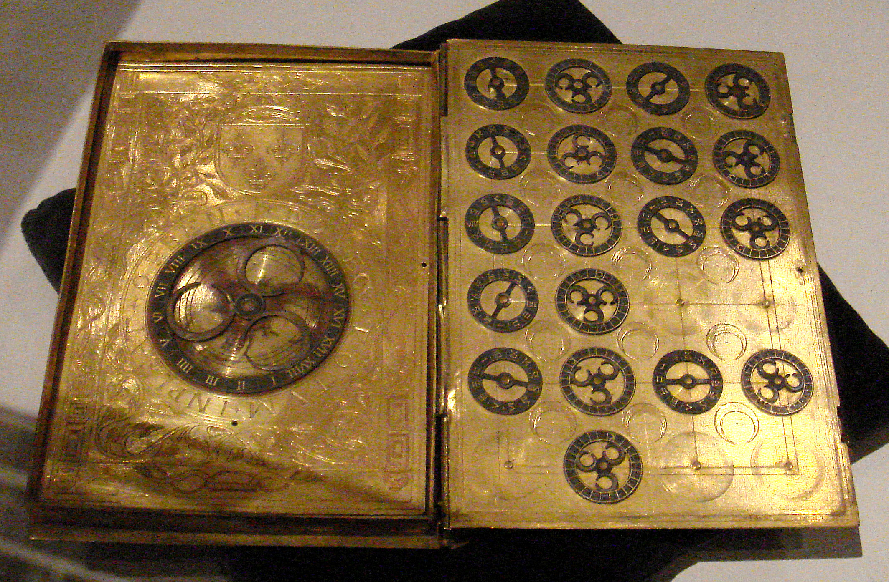
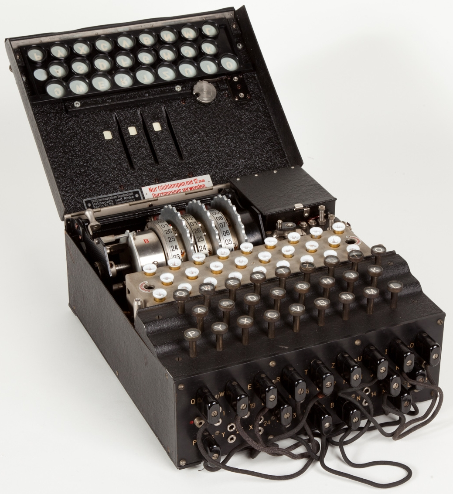
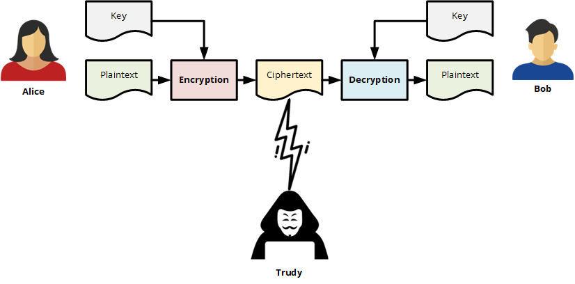
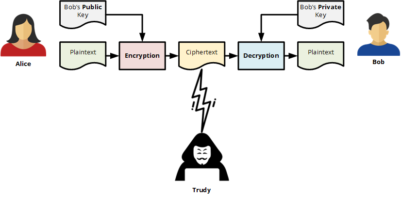
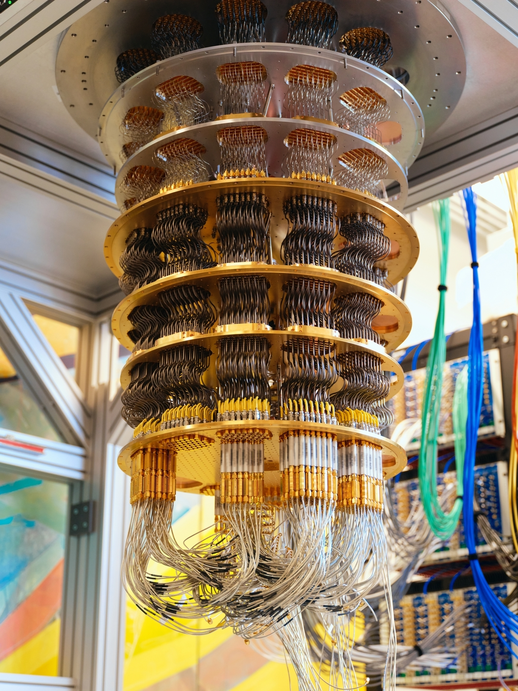

# Uma Brevíssima Introdução à Criptografia

Desde os tempos antigos, quando as pessoas começaram a escrever, surgiu a necessidade de manter
alguns textos escritos em segredo. Ao criar técnicas para ocultar informações registradas,
um novo campo científico surgiu – a criptografia.

> **Criptografia** é uma disciplina científica que trata do desenvolvimento
de sistemas para criptografar informações. A palavra criptografia vem das
palavras gregas kryptós (*oculto, secreto*) e graphein (*escrever*).

Na Índia, escritos de 2000 anos atrás falam de dois tipos de criptografia – o primeiro
tipo era baseado na substituição de letras com base em suas relações fonéticas,
e o segundo em um alfabeto codificado por emparelhamento de letras e uso de
letras recíprocas. Na Pérsia, atual Irã, também havia dois tipos de criptografia – o primeiro
escrito real era usado para correspondência oficial dentro do reino, e o segundo para comunicação com outros estados.

O primeiro livro sobre criptografia, intitulado "O Livro das Mensagens Criptográficas"
segundo fontes históricas, foi escrito pelo filósofo árabe Al-Khalil
(717–786), no qual permutações e combinações são usadas pela primeira vez
para listar todas as palavras árabes com e sem vogais. No entanto, métodos clássicos de criptografia
costumam revelar padrões estatísticos sobre a mensagem original, que podem
ser explorados para quebrar a cifra.

Após a descoberta da análise de frequência das letras em uma mensagem, o matemático árabe Al-Kindi escreveu o livro "Manuscrito para a Decifração de Mensagens Criptográficas" no século IX, no qual o uso de técnicas de análise de frequência foi descrito pela primeira vez.

> **Criptoanálise** é a disciplina científica que estuda métodos para
> "quebrar" sistemas criptográficos. A palavra criptoanálise vem das palavras gregas
> kryptós (*oculto, secreto*) e analýein (*análise*).

O primeiro tratado conhecido sobre criptografia foi escrito em 25 páginas pelo arquiteto italiano Leone Battista Alberti em 1467. Ele também é o criador do círculo de cifras e de outras soluções para ocultação de texto em duas camadas. Meio século depois, o trabalho de Johannes Trithemus sobre criptografia foi publicado em cinco volumes. No século XVI, contribuições significativas foram feitas pelo médico milanês Girolamo Cardano, pelo matemático Battista Porta e pelo diplomata francês Blaise de Vigenere.

No século XIX, concluiu-se que a criptografia não deveria depender do segredo dos algoritmos de criptografia, mas sim do segredo da chave. O segredo da própria chave deve ser suficiente para impedir que a mensagem criptografada seja quebrada. Isso se tornou um dos princípios fundamentais da criptografia, registrado em 1883 por Auguste Kerckhoffs (Princípio de Kerckhoffs). Mais explicitamente, foi reiterado por Claude Shannon, o fundador da Teoria da Informação e figura-chave na criptografia teórica, como o Máximo de Shannon: "o inimigo conhece o sistema".

Durante a Segunda Guerra Mundial, os alemães construíram uma máquina chamada Enigma que criptografava mensagens de uma forma nunca vista antes. No entanto, por mais revolucionária que fosse na época, os Aliados, liderados por Alan Turing, conseguiram quebrar o sistema criptográfico da Enigma por meio da criptoanálise.

Criptografia e criptoanálise são as duas principais disciplinas da criptologia.

> **Criptologia** é a ciência que trata de vários aspectos da segurança da informação. A palavra criptologia vem das palavras gregas kryptós (*oculto, secreto*) e logos (*ciência*).

## Presente

Após a Segunda Guerra Mundial, com o desenvolvimento da tecnologia da informação, a criptologia
e suas disciplinas científicas tornaram-se cada vez mais importantes. Computadores modernos
podem quebrar cifras simples em velocidades incríveis, então os algoritmos criptográficos se tornaram muito mais avançados. Hoje, a criptografia é geralmente dividida em
**criptografia simétrica**, onde a mesma chave é usada tanto para criptografar quanto para descriptografar...

...e **criptografia assimétrica**, onde um par de chaves pública e privada é usado:

Outra ferramenta essencial é a função hash criptográfica, que cria uma
impressão digital única dos dados e é amplamente utilizada na proteção de senhas,
assinaturas digitais e tecnologia blockchain.

## O Futuro

Olhando para o futuro, espera-se que a criptografia quântica se torne a base da comunicação segura. Ela se baseia no princípio da incerteza de Heisenberg da física quântica. No entanto, a computação quântica também representa uma ameaça para muitos algoritmos criptográficos atualmente em uso, o que levou ao desenvolvimento da criptografia pós-quântica.

A importância da criptologia na sociedade moderna não pode ser subestimada.
Sistemas criptográficos garantem a privacidade das comunicações eletrônicas,
tornam possível o comércio eletrônico seguro, protegem criptomoedas e, em alguns países,
chegam a proteger a votação eletrônica e a contagem de votos.
